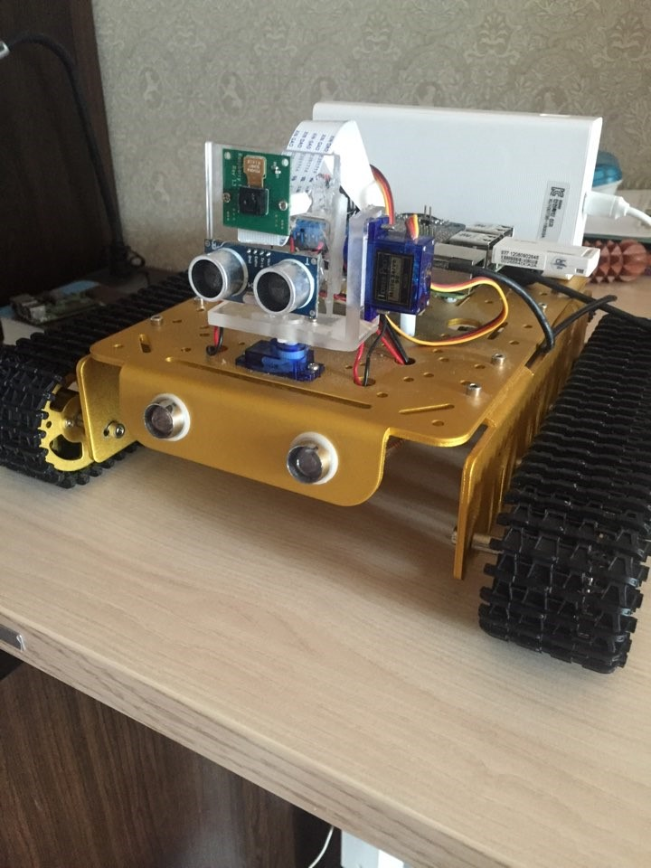
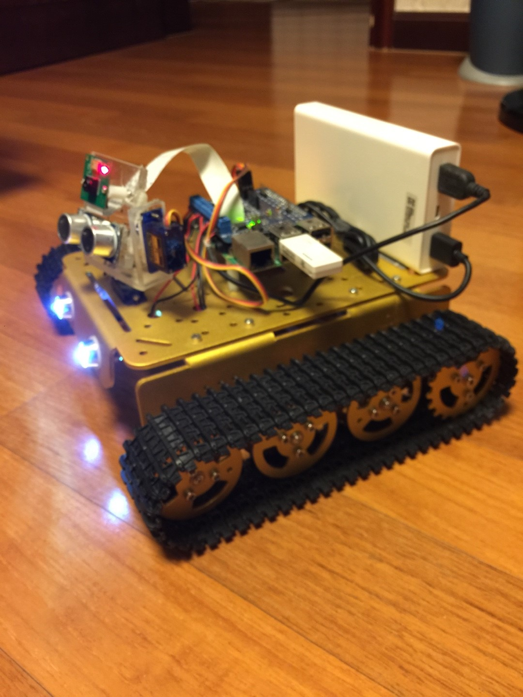
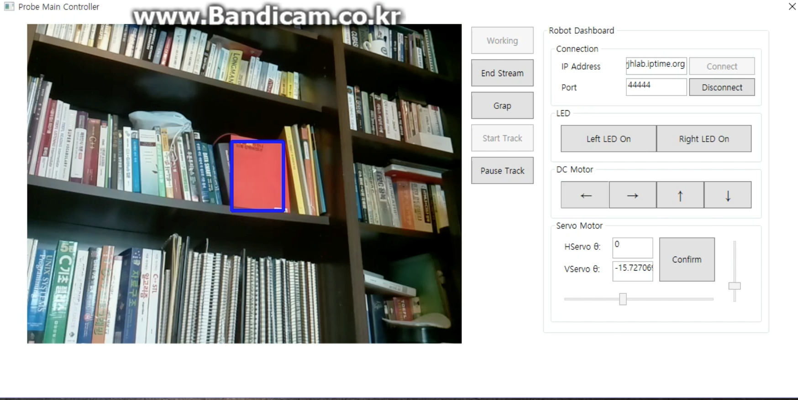
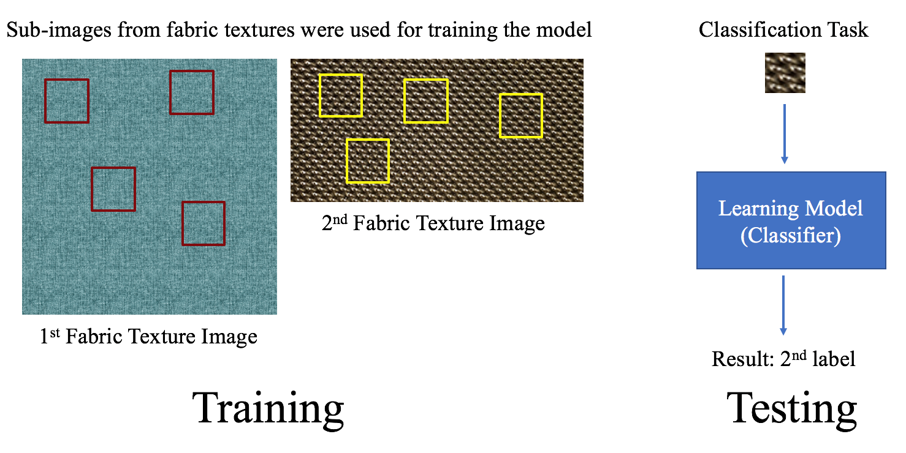
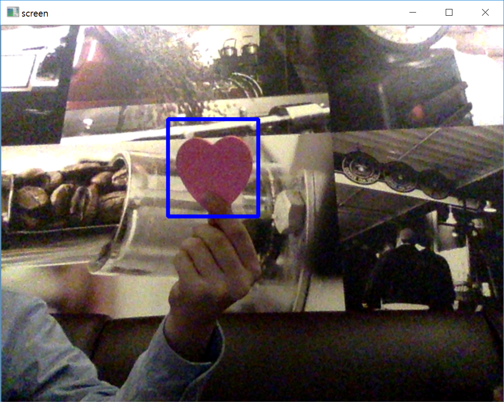
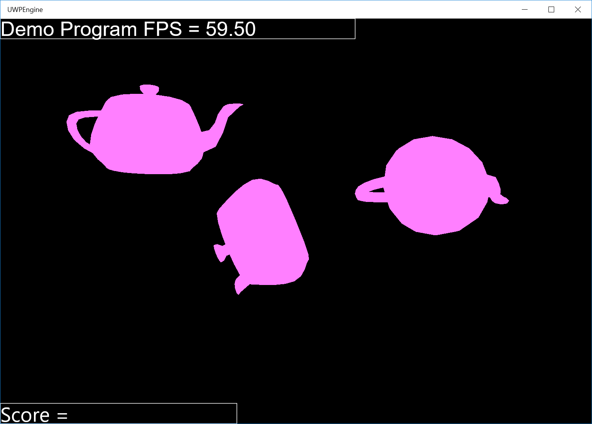
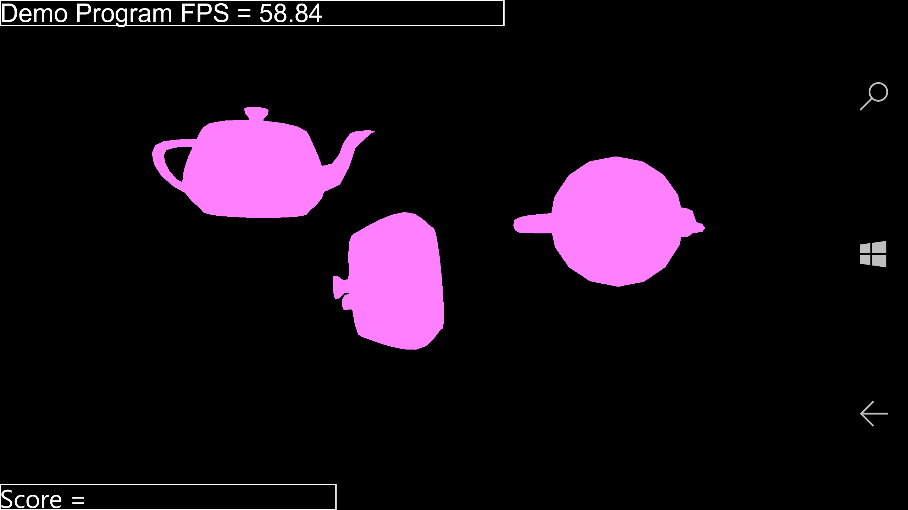

## Welcome to Jangho Park's portfolio page
This page contains information on some projects that I've worked on. 

### Image-based Car Scratch Retrieval System

As a research assistant at Seoul National University, I built a car scratch detector. In order to do so, I developed the method to effectively separate a car body from its background (image segmentation). This is needed to minimize the search area to find scratch. For example, as you can see from the figure 1 below (center image), only the white area (car body) is considered when finding a scratch area (red dots). Based on my observation that scratch area is made up of Harris Corner-like points, I made the program to first capture scratch points (red dots) using Harris Corner Detector algorithm, then useful properties (features), including the number of red dots, skewness of points, are extracted from these points. In other words, every given image is represented as a feature vector. 

 Figure 1 Extract useful features of scratch 

Figure 2 Image Retrieval Process

Given a set of car images, scratch patterns are extracted from the given images and these are used to construct a database (Figure 2). Then, a query image is also represented as feature vector, and the program calculates the feature distances from the query image feature vector and all feature vector from the database. Finally, as you can see the rightmost image of Figure 2, the program retrieves similar car scratch patterns using nearest neighbor algorithm and distance thresholding.

In order to run this program, do not clone 'master' branch. Clone 'NovelSegmentation' branch instead.

[Github link]<https://github.com/canslab/CarScratchDetector>

### Remote-controlled Probe (B.S. Graduation Project)

This project aims to build the remote-localized mobile robot that a user can order various tasks to the robot. I built the whole robot, including the head (camera part) of the robot. The main computing board was the Raspberry Pi 2 board. Two DC motors and two servo motors were powered by the PWM motor controller board. Power supply was a 20000 mAh external battery manufactured by Xioami.

I developed the PC-side software to enable a user to control the robot and monitor its surrounding using the attached camera, based on information transmitted via an Internet connection. Using a meanshift-based object-tracking algorithm, I enabled the robot to track a specific object and rotate its camera to automatically follow the tracked object. Also, the server program (robot-side software) runs on the Raspberry Pi 2 board, which was for handling commands come from the PC-side software and transmitting real-time video to it. The user can send commands in JSON format and these packets were dealt with by the server program. PC-side software was developed in C#, and the server-side software was built in Python.

 Robot 

 Robot 

 Client software

### Fabric Texture Recognizer

This project aims to make a classifier that automatically label an unknown fabric texture image based on a set of previously known fabric texture images. This project makes the best use of an important attribute: every fabric texture has its own periodicity, which was one of the main reasons I used Fourier analysis to interpret images. 

 An example of how this works 

Using a k-means clustering algorithm, I trained a classifier from a set of input texture images and determine labels of unclassified texture patterns using the learning model. The 2-D Fourier transform was used to extract frequency information from input fabric texture images. The frequency information was used to train the model. After building the model, the software used an input unknown fabric texture to calculate vector distances between the input image and every cluster. Then, the label of an input image is decided to be the index number of the cluster which is closest to the input image.

### Meanshift-based Object Tracker
This project aims to track a user-designated object (image). I developed the tracker using a mean-shift algorithm (kernel-based tracking). This tracker mainly used the hue value of the target object (image) to follow the object. Also, I implemented it using parallel programming in order to overcome the disadvantages of a meanshift-based tracker. A number of mean-shift procedure runs in parallel. Then each result of procedures is compared to the target image in probabilistic ways. 

This is made into a form of library (module) for the future use. This project was the core tracking library of the ‘Remote-controlled Probe’ project.

 The program is tracking a heart-shaped paper 

Markdown is a lightweight and easy-to-use syntax for styling your writing. It includes conventions for

### Simple Rendering Engine for Universal Windows Platform

This project aims to build a very simple rendering engine for future use, such as 3D game projects. This program can be used on various Windows 10 platforms, including Windows 10 Mobile and Windows 10 PC. Direct X 11, Universal Windows Platform framework and Visual Studio (C++) were used to develop this engine. In particular, this program was built from scratch, which means no other third-party libraries were used. The engine can read object model files (.obj) and render them.

 It is drawing several 3D objects on Windows 10 PC 

 It is drawing same 3D objects on different platform (Windows 10 Phone) 

For more details see [GitHub Flavored Markdown](https://guides.github.com/features/mastering-markdown/).

## If you want to know more about my projects, feel free to contact me anytime
