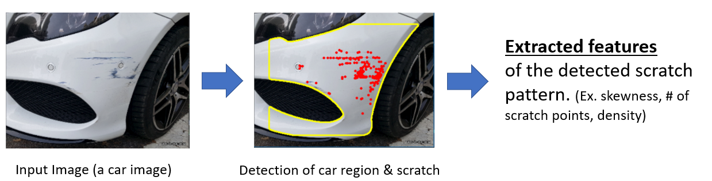
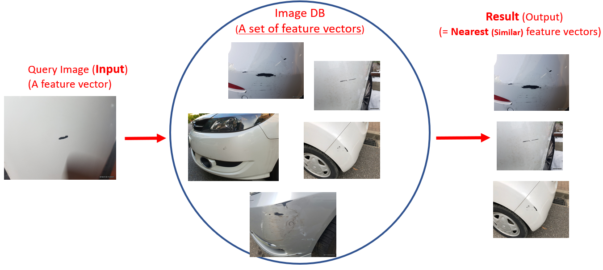

## Welcome to Jangho Park's portfolio page
This page contains information on some projects that I've worked on. 

### Image-based Car Scratch Retrieval System

As a research assistant at Seoul National University, I built a car scratch detector. In order to do so, I developed the method to effectively separate a car body from its background (image segmentation). This is needed to minimize the search area to find scratch. For example, as you can see from the figure 1 below (center image), only the white area (car body) is considered when finding a scratch area (red dots). Based on my observation that scratch area is made up of Harris Corner-like points, I made the program to first capture scratch points (red dots) using Harris Corner Detector algorithm, then useful properties (features), including the number of red dots, skewness of points, are extracted from these points. In other words, every given image is represented as a feature vector. 


Figure 1 Extract useful features of scratch

<br></br>

Figure 2 Image Retrieval Process

Given a set of car images, scratch patterns are extracted from the given images and these are used to construct a database (Figure 2). Then, a query image is also represented as feature vector, and the program calculates the feature distances from the query image feature vector and all feature vector from the database. Finally, as you can see the rightmost image of Figure 2, the program retrieves similar car scratch patterns using nearest neighbor algorithm and distance thresholding.

In order to run this program, do not clone 'master' branch. Clone 'NovelSegmentation' branch instead.

[Github link]<https://github.com/canslab/CarScratchDetector>


### Markdown

Markdown is a lightweight and easy-to-use syntax for styling your writing. It includes conventions for

```markdown
Syntax highlighted code block

# Header 1
## Header 2
### Header 3

- Bulleted
- List

1. Numbered
2. List

**Bold** and _Italic_ and `Code` text

[Link](url) and 
```

For more details see [GitHub Flavored Markdown](https://guides.github.com/features/mastering-markdown/).

### Jekyll Themes

Your Pages site will use the layout and styles from the Jekyll theme you have selected in your [repository settings](https://github.com/canslab/canslab.github.io/settings). The name of this theme is saved in the Jekyll `_config.yml` configuration file.

### Support or Contact

Having trouble with Pages? Check out our [documentation](https://help.github.com/categories/github-pages-basics/) or [contact support](https://github.com/contact) and we’ll help you sort it out.
